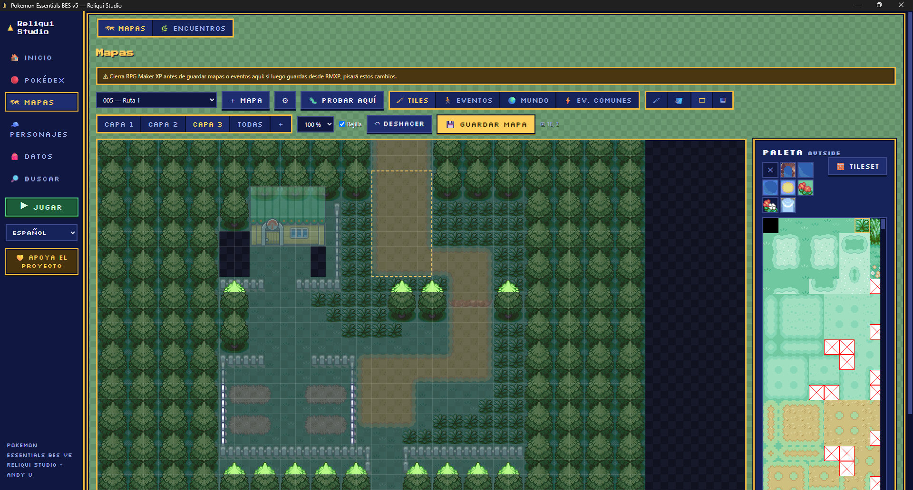
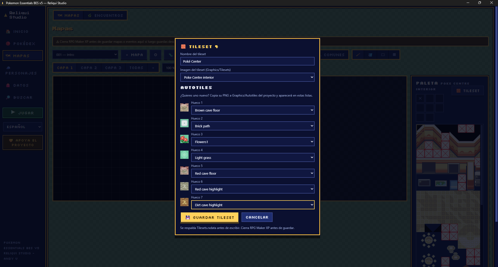
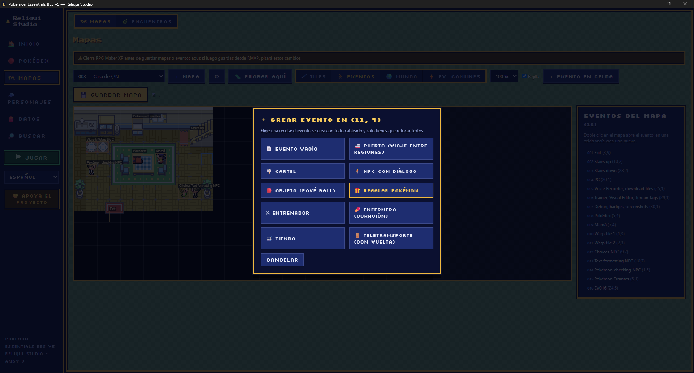
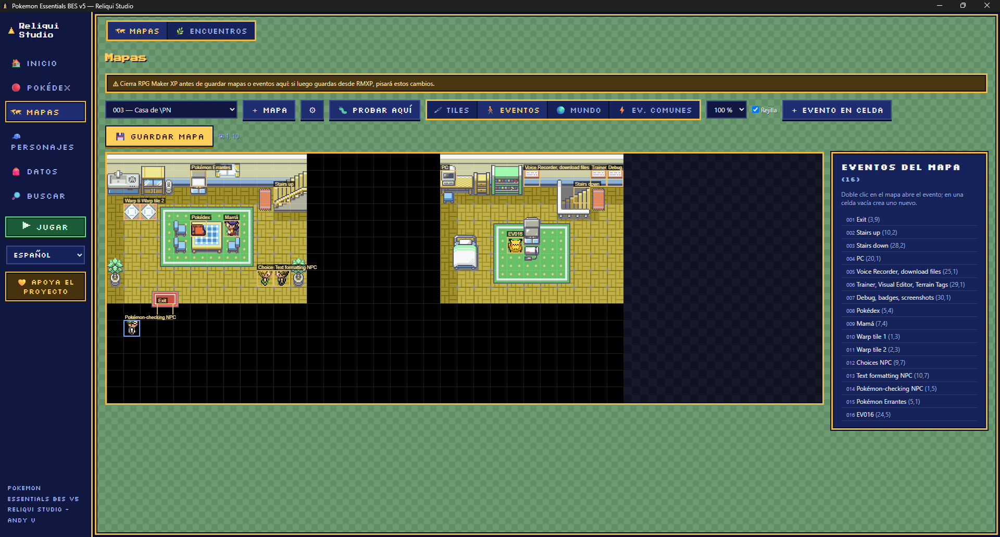
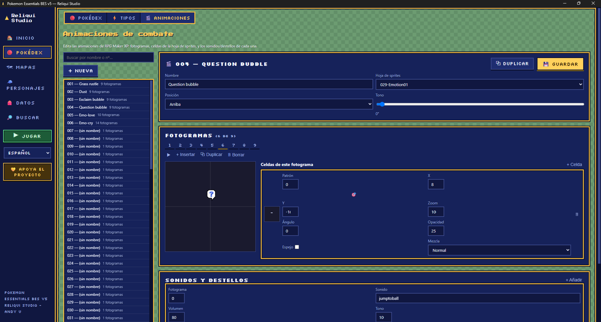
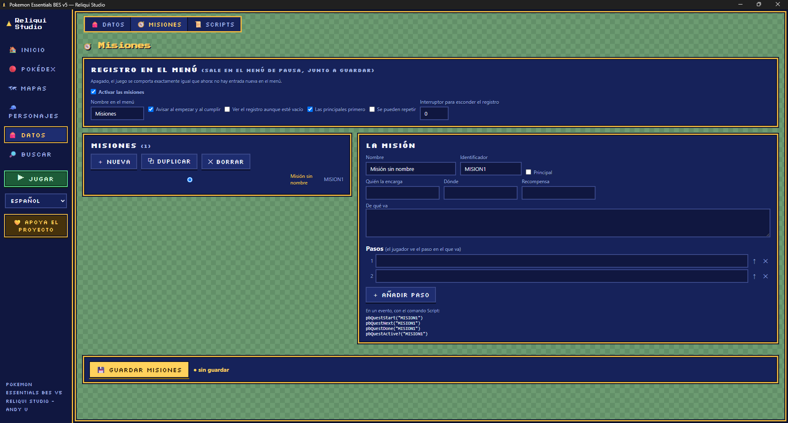
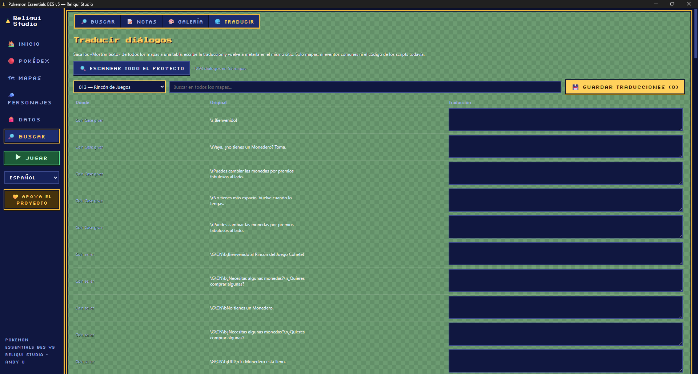
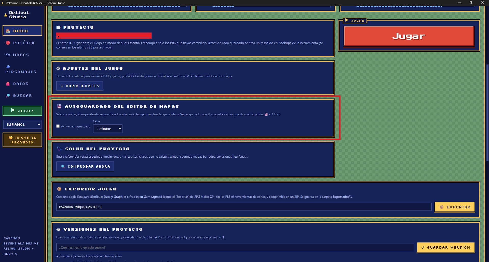

# Reliqui Studio — build Pokémon fangames without ever opening RPG Maker XP

All-in-one editor for Pokémon Essentials, available in 6 languages.

Hi everyone! Reliqui Studio is a free desktop tool for creating Pokémon fangames on top of Pokémon Essentials (using the BES base — a Spanish edition with content up to Gen 9). I started my own fangame over 10 years ago in RPG Maker XP, picked it back up recently, and got frustrated going back to the same old tools (Notepad for the PBS files, a map editor from 2004, Editor.exe for trainers…). So I built my own: an all-in-one editor where you never touch RPG Maker XP at all — not even for battle animations anymore. Here's what it does.

## Download

➡ Get the latest installer from the [Releases page](../../releases)

Windows 10/11 (64-bit). No admin rights needed — it installs per-user.
The installer includes the tool, a clean copy of the base engine and an overworld sprite pack. Create your project from the Home tab and press ▶ Play.

📖 Guides and reference live in the [Wiki](../../wiki).

## Screenshots

| | |
|---|---|
|  |  |
| **Map editor** — layers, rectangle selection, live cell coordinates | **🧱 Tileset dialog** — swap the graphic and the seven autotile slots |
|  |  |
| **Event recipes** — one click builds a working event | **Events** — drag them around the map, Ctrl+C/Ctrl+V to duplicate |
|  |  |
| **Battle animation editor** — frames, cells, sounds and flashes | **Quest editor** — ordered stages and the pause-menu log |
|  |  |
| **Content translator** — every map dialogue in one table | **Map autosave** — opt-in, with the interval you choose |

The interface ships in six languages; these shots were taken in Spanish. at the end of the block.

## Screenshots

| | |
|---|---|
|  |  |
| **Map editor** — up to 8 layers, rectangle brush, autotile borders | **🧱 Tileset dialog** — swap the tileset graphic and its 7 autotiles |
|  |  |
| **Battle animation editor** — frame timeline and live preview | **Quest editor** — ordered stages and the pause-menu log |
|  |  |
| **Content translator** — every dialogue in the game, in one table | **Pokédex** — all 1025 species with sprites |
-->

Interface available in **English, Spanish, German, French, Portuguese and Italian** (language selector right in the sidebar; adding another language is just a translation file, no recompiling).

## What's new in 1.2.1

### Map editor

**🧱 Tileset & autotile editor.** Change a tileset's image and its seven autotiles from inside the Studio. Adding a brand-new autotile is now just: drop its PNG into `Graphics/Autotiles` and pick it in the palette's **🧱 Tileset** dialog, with a live preview of each slot. Passage, priority and terrain-tag data is left untouched, and a graphic name that isn't actually on disk is refused before it can crash your game.

**▭ Rectangle brush.** Drag to fill a whole area in one stroke — palette blocks tile across it, autotile borders are recalculated, and a single Ctrl+Z undoes the entire rectangle.

**Move, copy and paste events.** Drag an event to another cell; Ctrl+C / Ctrl+V duplicate it as a new event with its own id. Neither one lands on a cell that is already taken.

**🎁 "Give a Pokémon" event recipe.** Pick species and level, write what the NPC says, and the event is built for you with a self switch so the gift can only be taken once.

**Cell coordinates on hover**, shown in the toolbar while you paint or place events.

**💾 Optional map autosave — off by default.** Turn it on from the Home tab and choose the interval (30 s to 10 min). It never interrupts you: it skips saving mid-stroke, mid-drag and mid-paste, and if the map changed outside the Studio it warns and switches itself off instead of overwriting anything.

### Everything else

**🥊 Battle animation editor — the last RPG Maker XP holdout is gone.** Full visual editor for `Animations.rxdata`: frame-by-frame timeline, cell placement over the sprite sheet (position, zoom, angle, opacity, blend mode), live preview at RGSS-normal speed, duplicate/insert/delete frames and cells. This was the one thing that still forced you back into RPG Maker XP — not anymore.

**🗒 Quest/mission editor.** A dedicated tab to build the pause-menu quest log: create quests with ordered stages, give each one an ID to reference from your events, and hide the whole log behind a switch until you're ready to ship it. No more juggling switches and variables by hand to track "is this quest active."

**🌐 In-game content translator.** Scans the message boxes of every event on every map — 1200+ lines in a mid-sized project — and lists them in one searchable table where you type the translation and write it straight back where it came from. Separate from the tool's own interface language. Common events and strings inside scripts are not covered yet.

**🐾 Follower Pokémon.** The first Pokémon in your party walks behind the player — on foot, on bike, across surf and dive, through teleports — with options for what happens if it's fainted, whether it can be talked to, and a switch to hide it. Sprites are copied into the project automatically when you turn it on.

**👀 Visible overworld encounters.** Wild Pokémon roam the map before you battle them, à la Let's Go / Legends Arceus: pick which maps have them (coexisting with random encounters or replacing them), how many spawn at once, how often, how far they wander, how long they linger, and whether they show up on water too.

**💀 Nuzlocke mode.** A full ruleset toggle: one capture per zone (by map or by region), fainted Pokémon are gone for good, mandatory nicknames, mandatory shiny captures, a graveyard/memorial list — all wired into your events through `pbNuzlocke?`, `pbNuzlockeBurnZone`, `pbNuzlockeFreeZone` and `pbNuzlockeGraveList`.

**📋 Pokédex tasks (Legends Arceus-style).** "See, catch or evolve species X, Y times" research objectives with optional rewards, toggled from the same settings screen.

**🛠 Quality-of-life toggles.** Let players forget HM-only moves like any other move, and add a "Show EVs" button to the Pokémon summary screen (with a one-click reset to 0) — the two things every Essentials community asks for.

**🌍 Regional forms, per map.** New in the alternate-forms system: assign which maps spawn wild Pokémon already wearing their Alolan/Galarian/Hisuian/Paldean form, by map ID, no scripting required.

### Fixed

- **Species added by extension plugins were invisible in the species browser.** Projects that add species the standard Essentials way (`pokemon_base_<plugin>.txt` / `pokemon_forms_<plugin>.txt`, e.g. the Generation 9 Pack) worked in the compiled game but not in the editor, which only read `PBS/pokemon.txt`. Those files are now merged into every listing, edits go back to the file the species came from, and the fix carries over to sprites, validation, fusion, regional forms and search. *(Reported by Ciegewell.)*
- **The Poké Ball item event crashed the game.** The recipe emitted `pbItemBall(:POTION)`, which is a module method in this engine, so the call raised `NoMethodError` the moment the player touched the ball. It now emits `Kernel.pbItemBall(...)`, the same call the Essentials compiler generates. *(Reported by Daluck89.)*
- **The Encounters tab didn't see maps created after the Studio was started.** It now re-reads the encounter data every time you open the tab — no restart. *(Reported by Daluck89.)*
- **Holding Ctrl+V spammed the paste message** once per key repeat in the map editor. *(Reported by Daluck89.)*

## How is it different from the usual RPG Maker XP + Essentials?

Essentials is a fantastic engine, but working with it means editing PBS files by hand in Notepad, using RPG Maker XP's map editor (three layers, no reliable undo), wrestling with Editor.exe for trainers and animations, and praying nothing gets corrupted. Reliqui Studio edits the exact same project files (PBS, maps, scripts), but:

| Before (RMXP + Essentials) | With Reliqui Studio |
|---|---|
| PBS files by hand in Notepad | Visual editors: Pokédex with sprites, clickable type chart, encounters, items, moves, trainers |
| RMXP map editor: 3 layers, no reliable Ctrl+Z | Up to 8 layers, undo, paint bucket, copy/paste regions, autotiles with automatic borders |
| Map connections by typing coordinates into `connections.txt` | Visual canvas: drag dozens of maps around, snap them edge to edge, and the connections write themselves |
| Events through the RMXP editor | Full event editor + 1-click recipes: NPC, sign, shop, nurse, trainer, teleport with auto-return, harbor |
| Battle animations through Editor.exe | Full visual animation editor: frame timeline, cell placement, live preview |
| New autotiles only through RMXP's tileset dialog | Drop the PNG in `Graphics/Autotiles` and pick it in the Studio, with previews |
| Moving an event = retyping its coordinates | Drag it across the map; Ctrl+C / Ctrl+V duplicate it |
| Quest/flag tracking by hand with switches | Dedicated quest editor with ordered stages and a pause-menu log |
| Translating your game's content | Built-in scanner + editor for every map dialogue in the game |
| Forms and regional variants by writing Ruby handlers | Visual forms editor with sprite slots and per-map regional spawning |
| No version control | Built-in Git: a "Save version" button plus automatic backups before every save |
| Sharing your game = copying the folder with everything exposed | Encrypted export (RGSSAD) + installer generator |

## Standout features

**Multiple shiny variants.** Every species can have several alternative shinies with conditions: custom rarity, weather, time of day, season, specific maps, a game switch, level range… or manual activation for gifts/bosses. The palette editor lets you pick new colors right on top of the original sprite, and the recolor applies at once to the front, back, icon and walking sprites — no drawing required.

**Alternate forms & regional variants.** Give any species extra forms from the Pokédex tab — different types, stats, abilities, movesets, size and Pokédex entry, each with its own sprites. Any field you leave empty is inherited from the base form. Mark which maps spawn wild Pokémon already wearing the form and you have your own regional variants, exactly like the engine's Alolan or Galarian ones.

**Level scaling by progress.** For long or multi-region adventures: wild Pokémon and trainer teams adjust to your party's average level (trainers keep their internal level spread and their custom movesets). Toggle it on and off with a switch from your own events.

**Gen 5 seasons + inter-region travel.** Real seasons (with Deerling/Sawsbuck forms), forceable for testing content; plus a travel system with destinations you unlock via switches, all managed visually.

**Battle mechanics toggles.** Turn Mega Evolution, Z-Moves, Dynamax or Terastallization off for your whole game with a checkbox — the button disappears from battle (for you and for rivals) and the interruptor locks them out story-side too.

**Fakemon wizard.** Create a complete species in one step: data, sprites automatically renamed into place, and an auto-generated shiny with a hue shift you tune live.

**Move effect picker.** All 457 engine effects, searchable in plain language ("burn", "drain", "raises Attack"…) with examples of which moves already use each one. Goodbye hex function codes.

**Damage/balance calculator, project notes & to-dos, common events with named switches, safe autosave, PC boxes from the pause menu, project health check** (finds broken references across the whole game) **, and a Play button that compiles and launches your game instantly** (mkxp-z runtime: resizable window, vsync, Alt+Enter fullscreen).

## How does it work under the hood?

A desktop app that edits the real files of your Essentials project — no weird proprietary formats. If you ever want to go back to RMXP, your project stays 100% compatible.

- Byte-for-byte verified writing of `.rxdata` files, and automatic rotating backups before every save.
- Multi-project: import any Essentials v9–v18 project (and it reads modern v19–v21 ones too).
- When you export your game, the data is encrypted into a `Game.rgssad` — nobody can casually open your maps or scripts.

ℹ **Note on languages:** the tool's interface is fully translated (6 languages). The game content that ships with the BES base engine (moves, items, dialogue) is in Spanish — the built-in translator tab is there to help you localize your own project's content.

## License and credits

Reliqui Studio is **free to use, including for commercial games** — whatever you make with it is
yours. Please share the [Releases page](../../releases) rather than re-uploading the installer
elsewhere, so everyone gets the current version. Full terms in [LICENSE.md](LICENSE.md).

Credits: Pokémon Essentials (Maruno and contributors), BES Spanish edition, mkxp-z runtime.

Pokémon and all related names are trademarks of Nintendo, Creatures Inc. and GAME FREAK Inc. This is
an unofficial, non-profit fan tool, not affiliated with or endorsed by them.

https://buymeacoffee.com/andyu19
